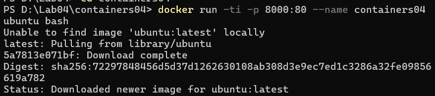
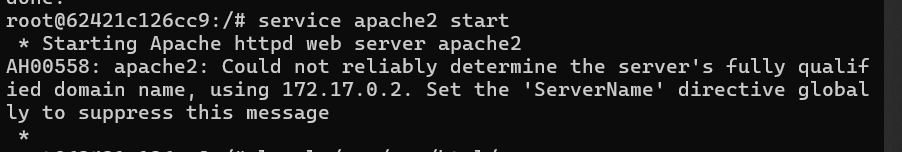
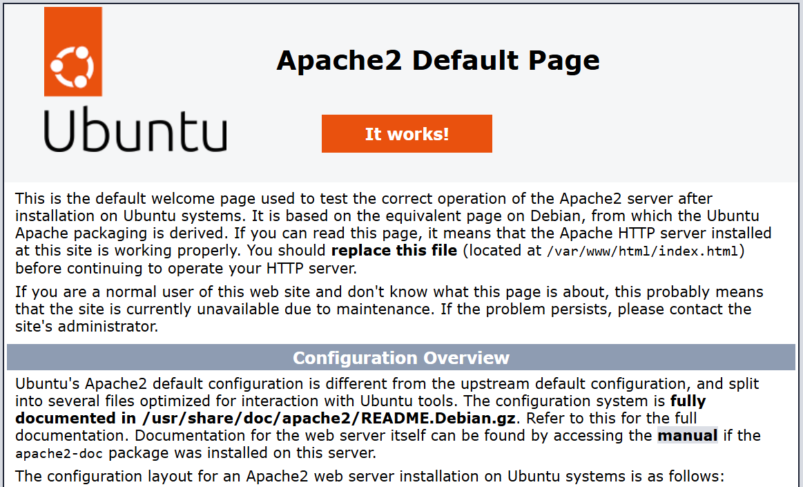
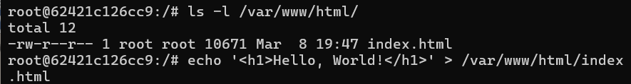
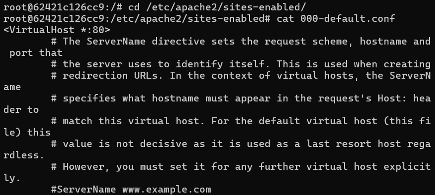
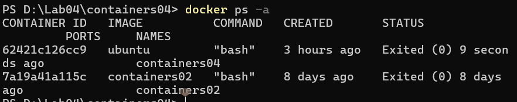
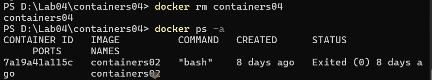

# Lucrare de laborator Nr4: Utilizarea containerelor ca medii de execuție

## Sarcina
Pornind de la imaginea oficială a sistemului de operare Ubuntu, să se creeze un container care să conțină un server web Apache. Să se creeze o pagină web care să conțină textul "Hello, World!" și să se afișeze într-un browser.

## Scop
Scopul acestui laborator este de a învăța cum să rulăm un container Docker, să instalăm și să configurăm un server Apache în interiorul acestuia, precum și să servim o pagină web personalizată. De asemenea, experimentăm gestionarea containerelor și documentarea procesului.

## Repository
Repository-ul `container04` există pe GitHub.

## Comandă de execuție a containerului
Pentru a porni containerul, rulează următoarea comandă:
```bash
docker run -ti -p 8000:80 --name containers04 ubuntu bash
```

### Explicație:
- `docker run` - Creează și rulează un container nou.
- `-ti` - Activează modul interactiv.
- `-p 8000:80` - Mapează portul 80 din container la portul 8000 pe gazdă.
- `--name containers04` - Atribuie numele `containers04` containerului.
- `ubuntu` - Utilizează imaginea Ubuntu.
- `bash` - Pornește un shell Bash în interiorul containerului.

## Instalarea Apache2
Rulează următoarele comenzi în interiorul containerului:
```bash
apt update
apt install apache2 -y
```

### Explicație:
- `apt update` - Actualizează lista de pachete disponibile.
- `apt install apache2 -y` - Instalează serverul web Apache2 și confirmă automat instalarea.

## Pornirea Apache2
Pentru a porni serviciul Apache în container:
```bash
service apache2 start
```

### Explicație:
- `service apache2 start` - Pornește serviciul Apache2.

## Listarea conținutului directorului `/var/www/html/`
Pentru a lista fișierele din directorul implicit al serverului web:
```bash
ls -l /var/www/html/
```

### Explicație:
- `ls -l` - Afișează lista fișierelor în format detaliat.
- `/var/www/html/` - Directorul implicit pentru paginile web servite de Apache.

## Crearea fișierului `index.html`
Crează o pagină HTML personalizată:
```bash
echo '<h1>Hello, World!</h1>' > /var/www/html/index.html
```

### Explicație:
- `echo '<h1>Hello, World!</h1>'` - Creează un titlu HTML.
- `>` - Redirecționează conținutul în `index.html`, suprascriind orice conținut existent.

După reîmprospătarea paginii `http://localhost:8000` în browser, ar trebui să apară mesajul `Hello, World!`.

## Vizualizarea conținutului fișierului `000-default.conf`
Pentru a verifica configurația implicită a Apache:
```bash
cd /etc/apache2/sites-enabled/
cat 000-default.conf
```

### Explicație:
- `cd /etc/apache2/sites-enabled/` - Se deplasează în directorul care conține site-urile activate în Apache.
- `cat 000-default.conf` - Afișează conținutul fișierului de configurare implicită a Apache.

## Listarea containerelor
Pentru a lista toate containerele, inclusiv cele oprite:
```bash
docker ps -a
```

### Explicație:
- `docker ps -a` - Afișează toate containerele, atât cele care rulează, cât și cele oprite.

## Ștergerea containerului
Pentru a șterge containerul `containers04`:
```bash
docker rm containers04
```

### Explicație:
- `docker rm containers04` - Șterge containerul specificat.

## Concluzie
Acest laborator ne-a permis să înțelegem conceptele de bază ale Docker, inclusiv rularea unui container, instalarea și configurarea unui server Apache și servirea unei pagini web personalizate. Am exersat gestionarea containerelor și explorarea fișierelor de configurare ale Apache, ceea ce oferă o bază solidă pentru utilizarea Docker în medii reale de dezvoltare și producție.

